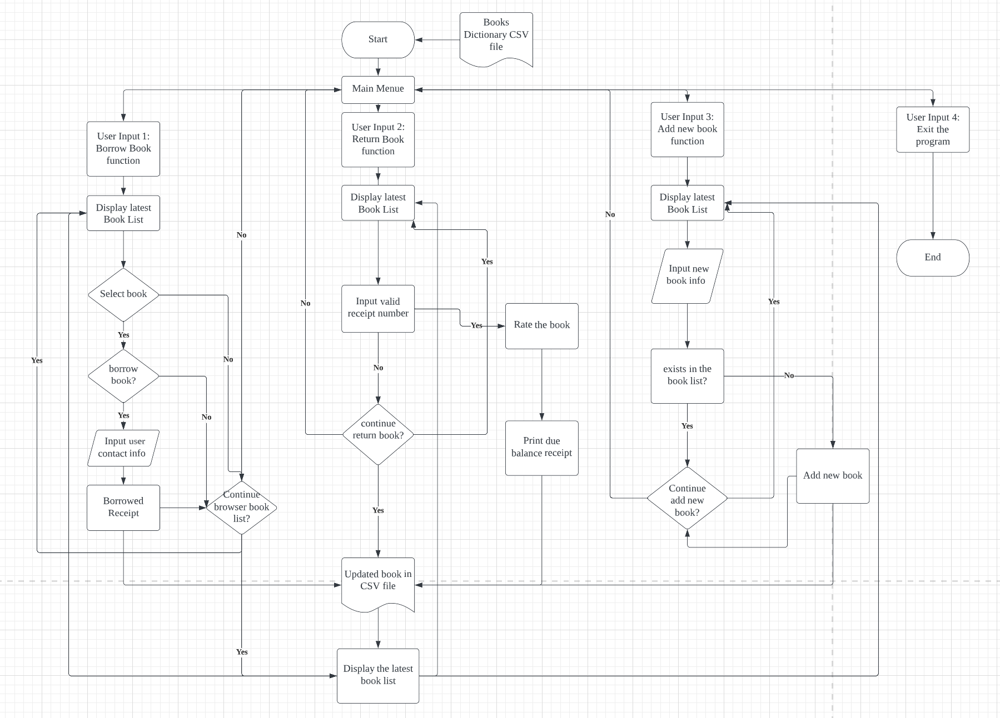
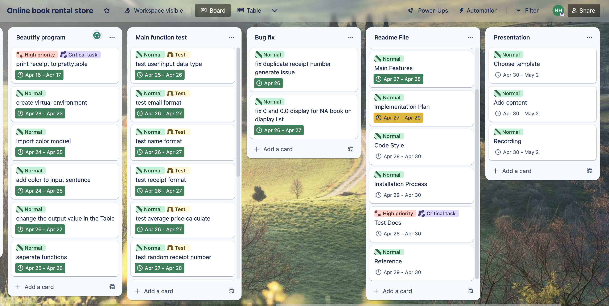

# T1A3 - Online Book Rental Store
---
### GitHub Repository 

**[Link to GitHub Repository](https://github.com/helenahan37/T1A3)**
***

### Presentation 

**[Link to Presentation Video](https://www.youtube.com/watch?v=sFNukY2D3HU)**
***
### Trello Board

**[Link to Trello Board](https://trello.com/b/pEMan2li/online-book-rental-store)**
***
## Main Features And Characteristics:
The Online Book Rental Store application, as the name suggests, is a convenient terminal application that allows customers to repeatedly view the book listing, rent books, return books, and add books after starting to use the application. It has the following main features and characteristics:

1. Customers can rent the books online and browse the inventory of books as a table.
2. Customers can return the books at their convenience and get a receipt and rate the book they have borrowed.
3. Customers can add new books to the store's inventory.

### Rent books:
#### Book list Table:
This feature allows users to borrow a book online, it imports the 'PrettyTable' module to create a well-organized and easily readable table to present the book information stored in a CSV document to customers (a try-except statement has been used here to check if a CSV file exists). The table is constructed using the PrettyTable function, which defines the column headers. Next, the program iterates through a list of books, appending the data of each book as a row to the table. 

Finally, the program prints out the entire table containing all book details, making it simple for customers to comprehend the availability of each book. 


#### Borrowed receipt:
When customers viewed the book list, the select book function prompts them to enter a book ID. The program then searches the book list to determine if the book is available or not and informs the customer of their choice's availability through prompt statements. 

If the customer successfully chooses an available book, they can input their personal information (regex format used here) to receive a borrowed receipt. 


If the book is not available, the program will use the imported "datetime" module to inform the customer of the number of days until the book becomes available again. This is done by subtracting the current date from the book's due date.


The program then updates the book list accordingly. Additionally, it uses a while loop to repeatedly ask the customer if they want to view the latest book information when borrowing, returning, or adding a book. If the customer agrees, the program displays the updated book information using the table.


### Return Books:

This feature allows users to return a book by entering its receipt number. It incorporates error handling using try-except statements to ensure a smooth user experience. The input's validity is checked by verifying that it's a positive integer and that it exists in the borrowed book list. If the input is invalid, the program prompts the user to enter a valid receipt number.

When a book with a matching receipt number is found, it is marked as "available" and the due date and receipt number are removed. The user is then asked to rate the book on a scale of 1 to 5, and the program verifies that the input is within the acceptable range. If the user enters an invalid rating, they are prompted to re-enter a valid rating.

If the rating is valid, the program calculates a new average rating for the book and updates it in the book list. Additionally, the program calculates the deposit and due balance that the user needs to pay and displays them along with the receipt of the returned book.

Overall, this feature provides a straightforward and user-friendly way for users to return books and update their ratings while ensuring the validity of the input and displaying relevant information to the user.


### Add books:
This feature is relatively straightforward. It allows users to add a new book to the online bookstore by entering its name and author. The "add_book" function accepts a list of books from the CSV file as input. It then creates a new dictionary for the book based on the user's input for the name and author, which is validated using regular expressions and prompt statements. Also, try-except statements to used here to catch any ValueError that may be raised when checking if the book already exists in the list. The new book's ID is added sequentially based on the current maximum value stored in the dictionary. The book's status and due date are marked as 'unavailable', which is used to determine the availability of the book when the user selects a book combined with the select book function. Other details, such as rental price, book rating, and receipt number, are not processed at this stage and are instead set to "N/A", which can be updated by the admin later. Finally, the program adds the new book information to the "books" list and returns the updated list.


## Software Development Plan:
When choosing a programming project, my goal was to implement functions within a program that could allow for adding, removing, and manipulating list items, performing simple mathematical operations, reading/saving files and combining with nested control structures. After considering these factors, I decided to choose the online book rental store project. This idea was also approved by the educator in our class group.

Here is the flowchart of my project:
## Flowchart


The entire project is being managed and tracked through Trello. This software allows me to categorize my project into different tags based on their functionalities and features, and further subdivide them into different items. I have classified these items based on their level of importance and set estimated completion times. These details will be adjusted and updated as the program progresses.

Here is the screenshot of my Trello Board:




## Help Documentation
### Installation Guide:

To install and run this program

1. Open the terminal and create a directory or navigate to the one you wish the project to go.
2. Copy the following command  ```git clone git@github.com:helenahan37/T1A3.git``` into your terminal and hit enter
3. Navigate to the source file by ```cd T1A3/src ```
4. This project required Python3, please check your Python version by run ```chmod +x python_version_check.sh``` and ```./python_version_check.sh``` 
5. Check venv environment by run ```chmod +x venv_check.sh``` and ```./venv_check.sh```
6. Now you can run ```./run.sh``` to start the app

### Dependencies:
The project requires the following dependencies, you can install all of them by run ```run.sh```
```
colored==1.4.4
iniconfig==2.0.0
mock==5.0.2
packaging==23.1
pluggy==1.0.0
prettytable==3.7.0
pytest==7.3.1
wcwidth==0.2.6
```

### System/hardware Requirements:

- 8GM of RAM or more
- macOS Ventura 13.0 or higher

## Testing Doc

The testing for this project involves a combination of manual and automated testing.

Here are some examples of automated testing using pyTest: 

[test_case.py](../src/test_case.py)

#### Test1:
This test is designed to test if the return_book function can successfully return a borrowed book with a valid receipt number and rating.

Test Case 1:

test_return_book_success() tests that when a user returns a borrowed book by entering a valid receipt number and rating, the function can correctly update the book's status, due date, receipt number, and rating, and return the updated book. The mocked user input simulates the user entering a valid receipt number 1 and rating 4.2 for the book that they are returning. The return_book function updates the book status to "available", sets the due date to "None", and updates the book rate with the average of the current book rate and the user's rating. The expected output which is (4.5+4.2)/2=4.3 (only keeps one decimal place) in the assert statement matches the updated book data with the correct values.
```python
# test case1- returning a borrowed book with a valid receipt number and rating -pass
@pytest.fixture
# create a fixture for sample book data
def sample_books():
    books = [
        {"name": "Book A", "rental_price": 10, "book_rate": 4.5, "status": "unavailable", "due_date": "2023-05-01", "receipt_number": 1},
        {"name": "Book B", "rental_price": 12, "book_rate": 3.2, "status": "available", "due_date": "None", "receipt_number": 0},
        {"name": "Book C", "rental_price": 15, "book_rate": 4.8, "status": "unavailable", "due_date": "2023-05-03", "receipt_number": 2},
    ]
    return books

def test_return_book_success(sample_books, mocker):
    # mock user input
    mocker.patch("builtins.input", side_effect=["1", "4.2"])
    
    # call the function
    returned_book = return_book(sample_books)
    
    # assert the book status, due date, receipt number, and book rate are updated correctly
    assert returned_book == {"name": "Book A", "rental_price": 10, "book_rate": 4.3, "status": "available", "due_date": "None", "receipt_number": 0}
```

Test Case 2:

test_return_book_invalid_receipt_number() tests that when a user enters an invalid receipt number 4, the function returns a None value without updating the book information.
```python
def test_return_book_invalid_receipt_number(sample_books, mocker):
    # mock user input
    mocker.patch("builtins.input", return_value="4")
    
    # call the function
    returned_book = return_book(sample_books)
    
    # assert the function returns None
    assert returned_book is None
```
#### Test 2:
This test mainly tests the functionality of the add_book() function, whether it can correctly add consecutive book IDs, and whether the program will report an error when the customer inputs an existing book name。

Test Case 1:

This test case is designed to test if the max id in the book list can be correctly collected, which takes a list of books and returns the maximum ID value of all the books in the list.

The test case creates a sample list of books with two books, each with a unique ID. The test then calls the get_max_id function with this list and checks if the function returns the correct maximum ID value, which should be 2.
```python
#Test Case 1 : Max id is correctly collected from the book list - pass
def get_max_id(books):
    return max(int(book["id"]) for book in books)

def test_get_max_id():
    books = [
        {"id": "001", "name": "Book A", "author": "Author A", "rental_price": 0.0, "status": "unavailable", "due_date": "unavailable", "book_rate": 0.0, "receipt_number": 0},
        {"id": "002", "name": "Book B", "author": "Author B", "rental_price": 0.0, "status": "unavailable", "due_date": "unavailable", "book_rate": 0.0, "receipt_number": 0}
    ]
    assert get_max_id(books) == 2
```
Test Case 2:

This test case is designed to verify if the book id correctly +1 to the book list when adding a new book. The test case sets up a sample list of books with two existing books and mocks user input values for a new book's name and author. The test then calls the add_book function with this list and checks if the function correctly adds the new book to the list with the expected ID.
```python
# Test Case 2: expected_id is correctly added to new book lists - pass
'''This test case is designed to verify if the book id correctly +1 to the book list when adding a new book.'''
def test_add_book():
    # Set up test data
    books = [
        {"id": "001", "name": "Book A", "author": "Author A", "rental_price": 0.0, "status": "unavailable", "due_date": "unavailable", "book_rate": 0.0, "receipt_number": 0},
        {"id": "002", "name": "Book B", "author": "Author B", "rental_price": 0.0, "status": "unavailable", "due_date": "unavailable", "book_rate": 0.0, "receipt_number": 0}
    ]
    
    # Mock input values
    mock_input = Mock(side_effect=["Test Book", "Test Author"])

    # Get the expected ID
    expected_id = str(get_max_id(books) + 1).zfill(3)

    with patch('builtins.input', mock_input):
        new_books = add_book(books)

    # Get the actual ID of the last book in the list
    actual_id = new_books[-1]["id"]

    # Assert that the new book has the expected ID
    assert actual_id == expected_id
```
Test Case 3:

This test case is designed to test when a user attempts to add a book to the book list that already exists.

The test case sets up a sample list of books with one existing book, which has the name "Python is amazing" and the author "Helena Han". The test then mocks user input values for a new book with the same name and author as the existing book, and calls the add_book function with this list.

The test then checks whether the function correctly detects that the book already exists in the book list and prints a message to inform the user that the book is already in the list and won't be added again.

```python
# Test Case 3: Book name already exists in the list - pass
def test_add_book_already_exists(capsys):
    books = [
        {
            "id": "001",
            "name": "Python is amazing",
            "author": "Helena Han",
            "rental_price": 0.0,
            "status": "unavailable",
            "due_date": "unavailable",
            "book_rate": 0.0,
            "receipt_number": 0
        }
    ]
    # Mock input values
    with patch('builtins.input', side_effect=["Python is amazing", "Helena Han"]):
        add_book(books)

    # Assert that the book is already in the list and won't be added again
    captured = capsys.readouterr()
    assert "Book 'Python is amazing' already exists in the list." in captured.out
```

## Manual Testing Ledger:
**[Link to Manual Testing Ledger](https://docs.google.com/spreadsheets/d/1Spjjr21O0xiv_KOr_VqqY-MLBG3ZR-DYsB5CUbTipL8/edit#gid=0)**


---
## Code Style:
---
This program is written following the PEP 8 Python language's code style guide, using clear variable and function names, appropriate indentation and comments, and other conventions to make the code easy to read and maintain.
Please refer to the following link for more details:

**[PEP 8 – Style Guide for Python Code](https://peps.python.org/pep-0008/)**

***

## Reference:

Kutaj, P. Simulating Single and Multiple Inputs using PyTest and Monkeypatch. *Search Medium*. Retrieved April 26, 2023, from https://pavolkutaj.medium.com/simulating-single-and-multiple-inputs-using-pytest-and-monkeypatch-6968274f7eb9

Malik, U. (2021, June 8). Python: Validate Email Address with Regular Expressions (Regex). *StackAbuse*. https://stackabuse.com/python-validate-email-address-with-regular-expressions-regex/

CodingNConcepts. Java Regex to Validate Phone Number. Retrieved April 17, 2023, from https://codingnconcepts.com/java/java-regex-to-validate-phone-number/#regex-to-match-10-digit-phone-number-with-no-space

Python RegEx. *W3Schools*. Retrieved April 16, 2023, from https://www.w3schools.com/python/python_regex.asp

Detect Python version in shell script. *Stack Overflow* Retrieved April 23, 2023, from https://stackoverflow.com/questions/6141581/detect-python-version-in-shell-script


System Requirements. *TechTerms*. Retrieved April 28, 2023, from https://techterms.com/definition/system_requirements


